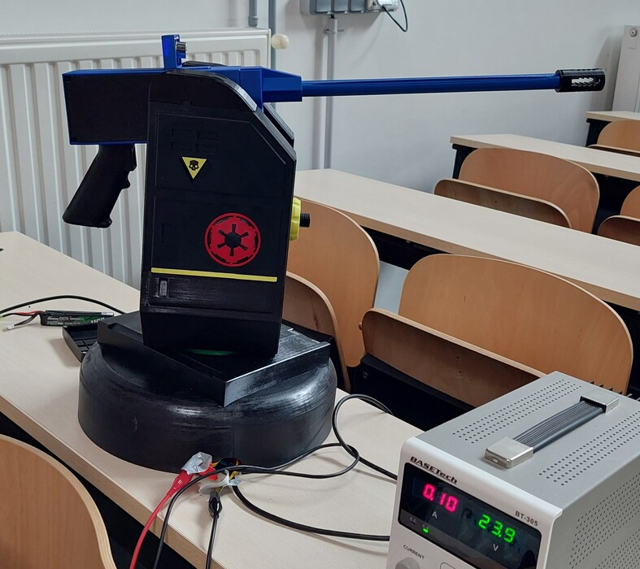
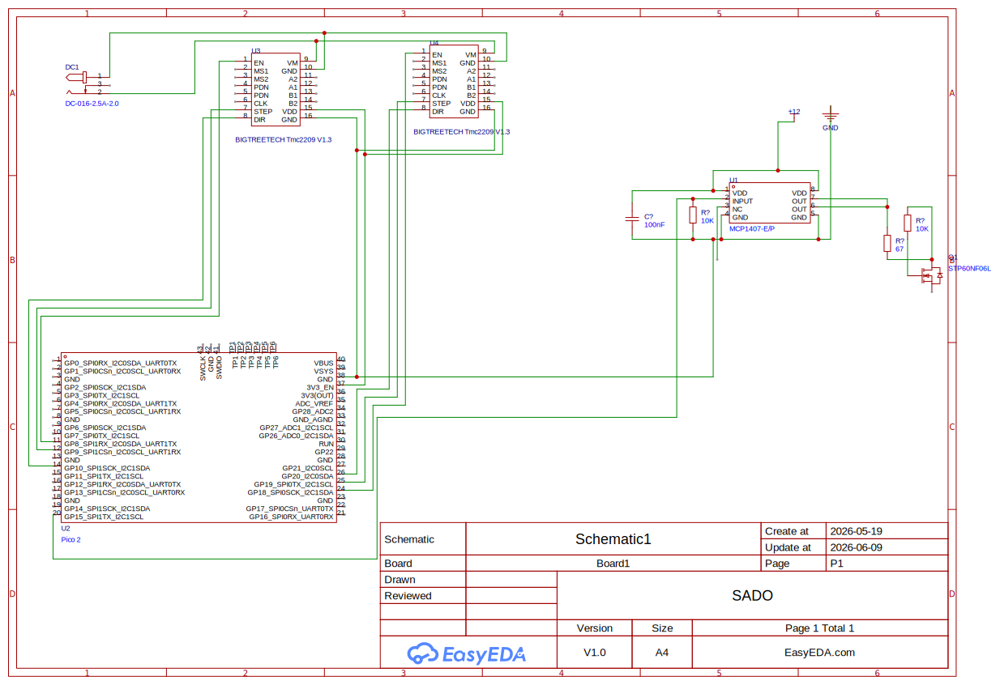

# Projet-Systeme-de-Defense-d-Objectif-Automatise

Conception d'une tourelle pouvant être contrôlée à distance par une manette ou complètement automatique via de la reconnaissance en direct de ballons de différentes couleurs grâce à une IA.

## Étapes

### Étape 1 : Éléments nécessaires

Vous aurez besoin d'imprimer les éléments nécessaires dans les quantités et matériaux indiqués sur la page 1.

Et vous aurer besoin d'acheter les objets présents sur la page 2.

https://docs.google.com/spreadsheets/d/1dJQVD0vWzvO0O84W56YvZOXAQwT8jr\_cPrxY0wQQ7l4/edit?usp=sharing

### Étape 2 : Réseau électronique

Soudez les composants sur une plaque de prototypage en suivant le schéma.

Le mosfet, son driver ainsi que condensateur doivent êtres sur une plaque séparée, installée dans la partie haute de la tourelle.

### Étape 3 : Assemblage

 **Assemblage de la base**

1. Insérez des inserts 3D correspondants dans tous les trous nécessaires.
2. Assemblez le roulement de la tourelle en mettant des billes de 6mm entre les deux parties (forcez la partie haute sur la partie basse pour clipser les deux parties).
3. Vissez le moteur avec le support moteur horizontal. 
4. Vissez le roulement de la tourelle sur la base N°1.
5. Vissez le&nbsp;support moteur horizontal sur le roulement de la tourelle en mettant la base du piedestal entre les deux.
6. Posez l'assemblage sur le piedestal.
7. Vissez le second moteur sur la base N°1 grace au support moteur d'élévation.
8. Collez les bases N°2 et N°3 sur le haut base N°1.
9. Assemblez le tendeur, puis insérez le dans le trou dans la base N°2. 

**Assemblage de la partie de tir**

1. Insérez les inserts 3d M3 et M2.5 dans les différents endroits.
2. Fixez les arbres a brides avec des vis M3x6.
3. Insérez la gearbox dans son support et sécurisez la avec 2 vis et ecrous M5 dans les trous en bas du support.
4. Alignez le cache haut avec les trous sur la partie haute du support et vissez avec des vis m3x50 afin de sécuriser le cache et la gearbox.
5. Coupez les axes a 85mm, inserez les dans les arbres a bride pui sécurisez els avec 4 vis m2.
6. Insérer le mag latch et le ressort dans la partie prévue a cette effet. Refermer avec le cache prévu.
7. Vissez le canon 3d sur sa base ainsi que le cache flamme au bout.
8. Inserer le canon airsoft dans le nozzle.
9. Faire glisser l'assemblage du canon sur le support gearbox, securiser avec une vis m3x50.
10. Mettre les caches cotes de la gearbox avec des vis m2.5x5
11. Mettre les roulements a billes et l'engrennage sur les arbres a brides (engrennage sur le coté gauche).

**Assemblage&nbsp;**

1. Poser la partie de tir sur la base.
2. Passer la courroie dans les 2 engrennages, puis la tendre en tournant le tendeur dans le sens horaire.
3. Passer les cables en laissant un peu de mous, passer le cable pour la caméra usb.
4. Sécuriser avec les connecteurs haut et 8 vis m5x30
5. Poser du mieux que possible la plaque avec le mosfet.
6. Brancher la batterie.
7. Poser les caches.
8. Enjoy!

### Étape 4 : Utilisation

Vous aurez besoin d'un ordinateur capable de faire tourner un modèle d'IA en local ainsi que 2 ports USB disponibles (voir un troisième si votre manette n'as pas de bluetooth).

Le programme "" doit être installé sur le raspberry pico afin de pouvoir controller les moteurs, l'alimentation du pico se fait via l'ordinateur grâce au cable USB.

Vous devez connecter le&nbsp;raspberry pico a l'ordinateur ainsi que la webcam, puis brancher l'alimentation en 24v 2a sur les cables des moteurs.

Le programme principal contient tout le nécessaire pour utiliser la tourelle, les commandes sont les suivantes:

- Joystick de gauche: déplacer la tourelle

- Gachette droite : tirer

- Bouton croix : changer de caméra (nécessaire dans les cas ou votre ordinateur possède une caméra, le programme peut ne pas sélectionner la bonne caméra au démarrage)

## Fichiers CAD

## Machines utilisées

Bambu Lab H2S, Anycubic Kobra S1

## Matériaux utilisés

PLA, PETG

